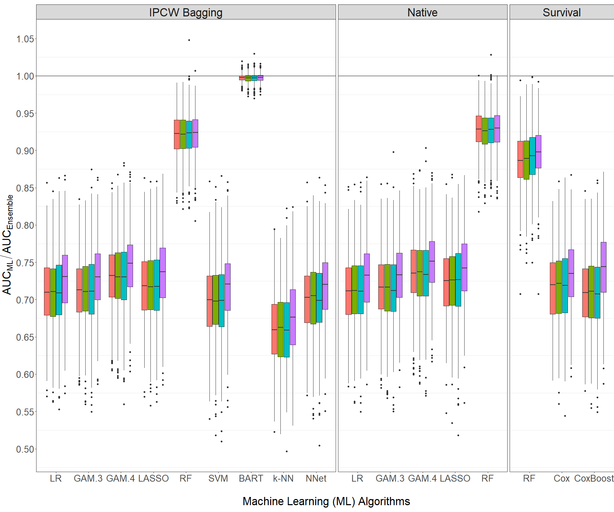

# ensBagg: Ensemble IPCW Bagging

**ensBagg** is an `R` package that uses inverse probability of censoring weighted
(IPCW) bagging approach as a pre-processing step to allow for all existing and any
newly developed machine learning methods for classification to be applied to right-censored data with or
without competing risk.

**ensBagg** provides the files to reproduce the simulation studies and the real data application in the forthcoming paper:
* Gonzalez Ginestet, P. et al. (2019). "Ensemble IPCW bagging: a case study in the HIV care
registry".



AUCs of each algorithm relative to the AUC of the ensemble based on 500 simulated data sets under the four scenarios (A=orange, B=green, C=blue and D=violet) using all available covariates and a Cox-PH model for censoring for predicting the event of interest in the test data set. The horizontal line denotes the ensemble.

## Important Note

The real data application in the paper relies on Swedish HIV care register (InfCareHIV) that cannot be openly shared. The data available on the folder fake_data is based on a fake, simulated  data that mimics the data used for the analysis. The R script which run the analysis of the data set is the same as the used for the analysis, but analysis results cannot be exactly reproduced. 

## Installation

You can install the development version of `ensBagg` from [GitHub](https://github.com/pablogonzalezginestet/ensBagg) with:


```R
if (!require("devtools")) install.packages("devtools")
devtools::install_github("pablogonzalezginestet/ensBagg")
```


## Vignette


See the vignette for details about examples usage of the functions found in  `ensBagg`: [online vignette](https://pablogonzalezginestet.github.io/ensBagg/)


